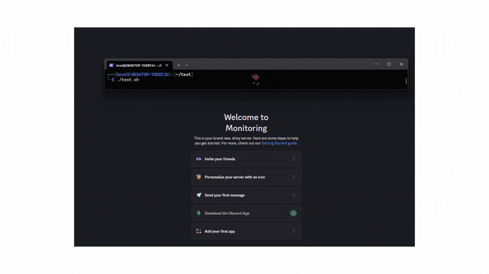
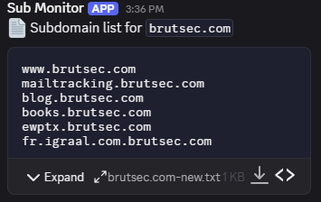

# 🔍 SubWatch – Automated Subdomain Monitoring Script

**SubWatch** is a lightweight Bash script that automates subdomain monitoring using `subfinder`, `anew`, and `notify`. It scans your target domains every 6 hours and sends newly discovered subdomains as text and file alerts to your **Discord channel** — perfect for bug bounty, red team, and recon workflows.

```bash
    _____       __  _       __      __       __
   / ___/__  __/ /_| |     / /___ _/ /______/ /_
   \__ \/ / / / __ \ | /| / / __ `/ __/ ___/ __ \
  ___/ / /_/ / /_/ / |/ |/ / /_/ / /_/ /__/ / / /
 /____/\__,_/_.___/|__/|__/\__,_/\__/\___/_/ /_/

            Made with ❤️ by Brut Security
```
---

## 📌 Features

- ⏱️ Runs automatically every 6 hours
- 🧠 Tracks and stores unique subdomains per domain
- 📨 Sends **text + file notifications to Discord**
- ⚙️ Uses `subfinder`, `anew`, `jq`, and **`notify`**
- ✅ Clean, fast, and automation-ready

---

## 🛠 Requirements

You must install the following tools before running `SubWatch`:

- [`subfinder`](https://github.com/projectdiscovery/subfinder) – for subdomain enumeration  
- [`anew`](https://github.com/tomnomnom/anew) – for deduplication  
- [`jq`](https://stedolan.github.io/jq/) – for parsing JSON  
- [`notify`](https://github.com/projectdiscovery/notify) – for **Discord notifications (text + file)** ✅

### 🔧 Install Tools via Go and APT:

```bash
go install -v github.com/projectdiscovery/subfinder/v2/cmd/subfinder@latest
go install -v github.com/tomnomnom/anew@latest
go install -v github.com/projectdiscovery/notify/cmd/notify@latest
sudo apt install jq
```

> Ensure your `$GOPATH/bin` is in your `$PATH` so all tools work globally.

---

## ⚙️ Setup Instructions

You must export your Discord Webhook:

```bash
export DISCORD_WEBHOOK="https://discord.com/api/webhooks/XXXX/XXXX"
```


1. **Clone the Repo**

```bash
git clone https://github.com/Brut-Security/subwatch.git
cd subwatch
```

2. **Create `domains.txt`**

Add target domains (one per line):

```
example.com
testsite.org
```

3. **Configure `notify` with Discord Webhook**

Run:

```bash
nano /.config/notify/provider-config.yaml
```

Add your Discord webhook and **name the provider `subdomains`** (this ID is used by the script).

Example config snippet:

```yaml
discord:
  - id: "subdomains"
    webhook_url: "https://discord.com/api/webhooks/XXXX/XXXX"
```

4. **Make the Script Executable**

```bash
chmod +x subwatch.sh
```

---

## 🚀 Usage

Run the script:

```bash
./subwatch.sh
```

> It will continuously run, scanning every 6 hours, and only notify when **new subdomains** are found.



---

## 📤 Output & Notifications

- Subdomain lists are stored as `<domain>-list.txt`
- New subdomains (if found) are:
  - Appended to the list
  - Saved to a temp `.txt` file
  - **Sent to Discord using `notify`** as both:
    - 💬 Message content
    - 📎 File attachment

---

## 🧠 Example Alert

```
🚨 New subdomains detected for `example.com` (3):
• api.example.com
• dev.example.com
• staging.example.com
```

> 📎 A `.txt` file is also sent with full subdomain list for easy access.



---

## 📣 Credits

Made with ❤️ by [**Brut Security**](https://brutsec.com)  
Join us for practical cybersecurity training, tools, and community.

- 🌐 [brutsec.com](https://brutsec.com)  
- 🐦 [Twitter](https://x.com/brutsecurity)  
- 💼 [LinkedIn](https://www.linkedin.com/company/brutsec/)  
- 📱 [Telegram](https://t.me/BrutSecurity)  
- 📧 info@brutsec.com

---

## 📄 License

MIT License — see [LICENSE](LICENSE) for details.  
